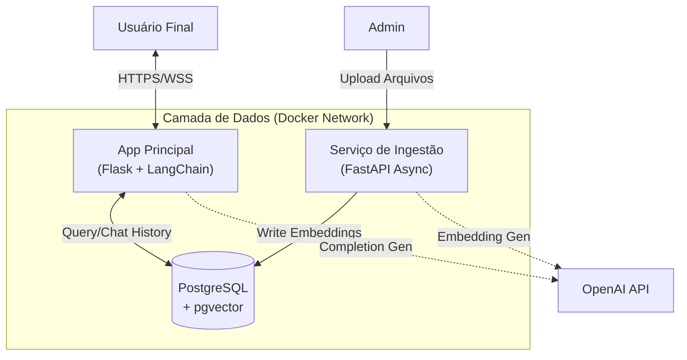

# Gladys IA (Enterprise RAG Architecture)

> **Nota:** Este repositório contém a documentação técnica, arquitetura e configurações de infraestrutura (IaC) do projeto. O código-fonte proprietário da lógica de negócios e regras de ingestão não está incluído publicamente.

## 🎯 Visão Geral

O **Gladys IA** é um sistema de **RAG (Retrieval-Augmented Generation)** projetado para ingestão, processamento e consulta semântica em bases de conhecimento corporativas.

O projeto nasceu como uma aplicação monolítica local (desktop), para ajudar eu e meu colegas a "conversar" com os documentos no obsidin de outros projetos e evoluiu para uma arquitetura de microserviços containerizada, visando escalabilidade, separação de responsabilidades e persistência robusta de dados vetoriais.

### 🚀 Evolução da Arquitetura

| Característica | Versão Legado (v1) | Versão Atual (v2 - Enterprise) |
| :--- | :--- | :--- |
| **Arquitetura** | Monólito Desktop (.exe) | Microserviços (Docker) |
| **Backend** | Flask (Tudo em um) | **FastAPI** (Ingestão) + **Flask** (Interface/Chat) |
| **Banco de Dados** | SQLite + FAISS (Local) | **PostgreSQL + pgvector** |
| **Ingestão** | Síncrona (bloqueante) | Assíncrona / Dedicada |
| **Deploy** | Executável Windows | Containers Docker / Nuvem |

---

## 🏗️ Arquitetura do Sistema

O sistema foi desacoplado para permitir que o processo de ingestão de documentos (que é intensivo em CPU/IO) não afete a performance da interface de chat.


## Componentes
- Serviço de Ingestão FastAPI (File_manager):

  - Responsável por receber arquivos (PDF, DOCX, MD, XLSX).

  - Realiza o chunking (fragmentação) inteligente.

  - Gera embeddings via OpenAI API e persiste no Postgres.

- Aplicação Principal (Flask):

  - Gerencia autenticação (Flask-Login) e sessões.

  - Interface de Chat com memória persistente (Chat History no Postgres).

  - Feedback loop: Usuários podem avaliar respostas, ajustando o tuning futuro.

- Banco de Dados (Postgres + pgvector):

  - Substituição do FAISS por pgvector para permitir buscas vetoriais diretamente no banco relacional, facilitando backups e consistência.

## 🛠️ Stack Tecnológica
### Backend & AI
- Linguagens: Python 3.12
- Frameworks: FastAPI (Ingestão), Flask (Web App)
- AI/LLM: OpenAI GPT-4o, LangChain
- Vector Search: PostgreSQL com extensão pgvector
### Processamento de documentos
- python-docx (>=0.8.11): leitura e processamento de documentos Microsoft Word (.docx)
- openpyxl (>=3.0.0): leitura e processamento de planilhas Excel (.xlsx)
- pdfplumber (>=0.7.0): extração de texto de documentos PDF
- markdown (>=3.4.0): processamento e renderização de conteúdo Markdown
- pandas (>=1.5.0): manipulação e análise de dados estruturados
### Frontend & UI
- Bootstrap 5: framework CSS para design responsivo
- Font Awesome: biblioteca de ícones para elementos de UI
- HTML5/CSS3: padrões web para marcação e estilização
- JavaScript: interatividade no cliente para a interface de chat
### Infraestrutura & DevOps
- Containerização: Docker & Docker Compose
- Web Server: Gunicorn (Production) / Uvicorn (ASGI)
- Monitoramento: logs estruturados (CSV/JSON) com rotação automática (diária, mensal, anual)

## 🌟 Funcionalidades de Destaque
Busca Híbrida: Capacidade de filtrar por metadados (ex: nome do arquivo, data) junto com a busca semântica vetorial.

Memória de Longo Prazo: O chat mantém o contexto de conversas passadas recuperando vetores do histórico do próprio chat, não apenas dos documentos.

Feedback do Usuário: Sistema de "Thumbs up/down" integrado ao fluxo de chat para curadoria da base de conhecimento.

Gestão de custos: monitoramento do consumo de tokens e custo de embeddings por usuário, setor e empresa.

Gestão de acessos (multi-empresa): segregação de dados e permissões por empresa, setor e licença (Free, Pro, Premium).

Isolamento por empresa (multi-tenant): cada empresa acessa apenas seus próprios dados e histórico.

Controle por setor (RBAC): permissões e visibilidade configuráveis por área/departamento.

Planos de licença: recursos e limites variam conforme o plano (Free/Pro/Premium).

Suporte a Múltiplos Formatos: Processamento nativo de .md, .docx, .pdf, .xlsx e .ppt.

## 🚀 Início Rápido
> **Nota:** O Configuação a seguir indica como rodar localmente a versão v1, monolitica e basica da arquitetura real da Gladys IA.

### 1. Configuração Inicial

1. **Configure o arquivo `config.json`** (veja seção de configuração abaixo)
2. **Execute o arquivo `Gladys IA.exe`**
3. **Acesse a aplicação** aguarde um pouco pois dependendo da quantidade de documentos no vault a primeira inicialização pode ser lenta. No navegador em `http://localhost:5000` ou em outro dispositivo em `http://IpDoHost:5000`
4. **Faça login ou registre-se** com as credenciais padrão do administrador ou crie uma nova conta:
   - **Usuário:** `administrador`
   - **Senha:** `administrador`

### 2. Primeiro Uso

1. Após fazer login, você pode:
   - Criar uma nova conta de usuário
   - Começar a usar o chat imediatamente
   - Gerenciar seus documentos

## ⚙️ Configuração do Arquivo config.json

O arquivo `config.json` é essencial para o funcionamento da aplicação. Aqui está um exemplo completo com comentários:

```json
{
  "AI_MODEL": "gpt-4o",                         // Modelo de IA principal (gpt-4o, gpt-4o-mini, gpt-4, gpt-3.5-turbo)
  "DECISION_MODEL": "gpt-4o-mini",              // Modelo usado para tomada de decisões (mais rápido/econômico)
  "WEB_SEARCH_MODEL": "gpt-4o-search-preview",  // Modelo para buscas na web (quando habilitado)
  "EMBEDDING_MODEL": "text-embedding-3-small",  // Modelo de embedding para busca vetorial
  "OPENAI_API_KEY": "sua-chave-api-aqui",       // SUA CHAVE DA API OPENAI (OBRIGATÓRIO)
  
  "MODEL_DECISION_CONFIG": {
    "enable_decision_layer": true,              // Habilitar camada de decisão inteligente
    "use_web_search_threshold": 0.7,            // Limiar para usar busca na web (0-1)
    "context_sufficiency_threshold": 0.6,       // Limiar de suficiência de contexto (0-1)
    "max_decision_tokens": 500,                 // Máximo de tokens para análise de decisão
    "decision_temperature": 0.3                 // Temperatura para decisões (0-2, menor=mais conservador)
  },
  
  "SEARCH_CONFIG": {
    "short_query_threshold": 50,                // Limite de caracteres para consultas curtas
    "medium_query_threshold": 150,              // Limite de caracteres para consultas médias
    "short_query_results": 2,                   // Resultados para consultas curtas
    "medium_query_results": 3,                  // Resultados para consultas médias
    "long_query_results": 4,                    // Resultados para consultas longas
    "max_total_context_length": 8000,           // Tamanho máximo do contexto total
    "max_chunk_length": 4000,                   // Tamanho máximo de cada fragmento
    "max_summary_length": 1500,                 // Tamanho máximo do resumo
    "search_multiplier": 3,                     // Multiplicador de busca
    "max_chunks_per_file": 2,                   // Máximo de fragmentos por arquivo
    "comprehensive_search_results": 10,         // Resultados para busca abrangente (leia QUERY_INTENT para mais detalhes)
    "comprehensive_context_multiplier": 2,      // Multiplicador de contexto abrangente (leia QUERY_INTENT para mais detalhes)
    "max_total_comprehensive_results": 15       // Máximo de resultados abrangentes (leia QUERY_INTENT para mais detalhes)
  },
  
  "ADVANCED_SEARCH_CONFIG": {
    "comprehensive": {
      "context_multiplier": 2,                  // Multiplicador de contexto para busca abrangente
      "max_context_length": 15000               // Comprimento máximo de contexto para busca abrangente
    },
    "filename_priority": {
      "context_multiplier": 2,                  // Multiplicador quando o nome do arquivo é relevante
      "content_multiplier": 3,                  // Multiplicador de conteúdo para arquivos prioritários
      "max_content_length": 12000               // Comprimento máximo para conteúdo prioritário
    }
  },
  
  "INDEX_CONFIG": {
    "vault_path": "C:\\Caminho\\Para\\Seu\\Vault", // Caminho para sua pasta com os arquivos, subdiretórios também são lidos se não forem banidos, use "\\"
    "index_path": "vector_index/faiss_index.pkl",   // Caminho do índice vetorial (Gera automático mesma pasta do exe por padrão)
    "enable_usage_tracking": true,                   // Habilitar rastreamento de uso (tela de admin)
    "verbose": true,                                 // Controle de log detalhado
    "auto_update": false,                            // Habilitar atualização automática do índice
    "max_chunk_size": 3000,                         // Tamanho máximo de cada fragmento
    "chunk_overlap": 200,                           // Sobreposição entre fragmentos
    "min_chunk_size": 100,                          // Tamanho mínimo de fragmento
    "auto_update_interval": 60,                     // Intervalo de atualização automática (em segundos)
    "max_embedding_chars": 6000,                    // Máximo de caracteres por embedding
    "excluded_paths": {                             // Pastas padrão excluídas da indexação (é possível adicionar novas pela tela de administração)
      ".obsidian": true,                            // Configurações do Obsidian
      ".git": true,                                 // Repositório Git
      ".vscode": true,                              // Configurações do VS Code
      "node_modules": true,                         // Dependências Node.js
      "__pycache__": true,                          // Cache Python
      ".DS_Store": true,                            // Arquivos do macOS
      "Thumbs.db": true,                            // Cache de miniaturas Windows
      "desktop.ini": true                           // Configurações de desktop Windows
    },
    "enable_document_summaries": true,              // Habilitar geração de resumos de documentos
    "summary_min_file_size": 5000,                  // Tamanho mínimo do arquivo para gerar resumo (em caracteres)
    "summary_max_input_chars": 50000,               // Máximo de caracteres processados para resumo
    "summary_block_size": 6000,                     // Tamanho de cada bloco para processamento de resumo
    "summary_model": "gpt-4o-mini"                  // Modelo usado para gerar resumos
  },
  
  "CHAT_MEMORY_CONFIG": {
    "chat_index_path": "vector_index/chat_faiss_index.pkl", // Caminho do índice de memória do chat (Gera automático mesma pasta do exe por padrão)
    "enable_usage_tracking": true,                          // Habilitar rastreamento de uso (tela de admin)
    "chat_verbose": true,                                   // Controle de log detalhado
    "max_short_term_memory": 20,                            // Máximo de trocas na memória de curto prazo
    "max_short_term_tokens": 4000,                          // Limite de tokens para memória de curto prazo
    "long_term_memory_chunk_size": 1000,                    // Tamanho do fragmento de memória de longo prazo
    "chat_auto_update_interval": 300,                       // Intervalo de atualização do chat (em segundos)
    "relevance_threshold": 0.5,                             // Limiar de relevância para recuperação de memória (0-1)
    "max_memory_results": 5,                                // Máximo de memórias relevantes a recuperar
    "default_hard_delete": false,                           // Modo de exclusão padrão (false=soft, true=hard. Hard delete reconstrói todo o índice a cada mensagem apagada)
    "batch_embedding_threshold": 10                         // Limite para processamento em lote de embeddings
  },
  
  "PERFORMANCE_CONFIG": {
    "enable_context_logging": true,    // Habilitar logs de tamanho de contexto
    "enable_search_timing": true,      // Habilitar logs de tempo de busca
    "context_size_warning": 6000       // Avisar quando o contexto exceder este tamanho
  },
  
  "LOGGING_CONFIG": {
    "logs_directory": "logs",          // Diretório de logs (Gera automático mesma pasta do exe por padrão)
    "log_level": "INFO",               // Nível de log (DEBUG, INFO, WARNING, ERROR)
    "log_format": "csv",               // Formato dos logs
    "include_timestamp": true,         // Incluir timestamp nos logs
    "max_log_files": 30,               // Máximo de arquivos de log
    "log_rotation": "daily"            // Rotação de logs (daily, weekly, monthly)
  },
  
  "FILE_READER_CONFIG": {
    "verbose": true                    // Controle de log detalhado
  }
}
```

### 🔑 Configurações Importantes

**OBRIGATÓRIO - Chave da API OpenAI:**
## 📄 Requisitos do Pandoc

O Pandoc é uma ferramenta essencial para a conversão de documentos. Para garantir que a aplicação funcione corretamente, você deve ter o Pandoc instalado em seu sistema.

### Instalação do Pandoc

Você pode baixar o Pandoc a partir do site oficial: [Pandoc](https://pandoc.org/installing.html).

Após a instalação, verifique se o Pandoc está acessível no terminal ou prompt de comando executando:

```bash
pandoc --version
```

Se o comando retornar a versão do Pandoc, a instalação foi bem-sucedida.
```json
"OPENAI_API_KEY": "sk-proj-sua-chave-aqui"
```

**OBRIGATÓRIO - Caminho do Vault:**
```json
"vault_path": "C:\\Caminho\\Para\\Seu\\Vault", // Caminho para sua pasta com os arquivos, subdiretórios tambem são lidos se não forem banidos, use "//"
```
## 📁 Tipos de Arquivos Suportados

A aplicação suporta os seguintes tipos de arquivo:
- **Markdown** (.md)
- **Word** (.docx)
- **Excel** (.xlsx)
- **PDF** (.pdf)
- **Texto** (.txt)

## 💬 Como Usar o Chat

### Iniciando uma Conversa

1. **Faça login** na aplicação
2. **Clique em "Novo Chat"** para iniciar uma conversa
3. **Digite sua pergunta** na interface de chat
4. **A IA buscará** automaticamente nos seus documentos e fornecerá uma resposta contextualizada

### Gerenciando Chats

- **Visualizar todos os chats** no painel principal
- **Excluir chats** que não precisa mais
- **Cada chat mantém** seu próprio histórico de conversa
- **Memória persistente** - a IA lembra do contexto das conversas anteriores

## 🔐 Segurança e Autenticação

### Usuário Administrador Padrão
- **Usuário:** `administrador`
- **Senha:** `administrador`

### Recursos de Segurança
- **Hash de senhas** 
- **Gerenciamento de sessão** com Flask-Login
- **Isolamento de usuários** (cada usuário acessa apenas seus próprios chats)
- **Proteção CSRF** através de formulários Flask

## 📞 Contato
Interessado em saber mais sobre a implementação ou discutir arquiteturas de IA Generativa?

Desenvolvedor: Igor Augusto

LinkedIn: linkedin.com/in/iaugusto/

Email: igor.a.r.miranda@gmail.com
